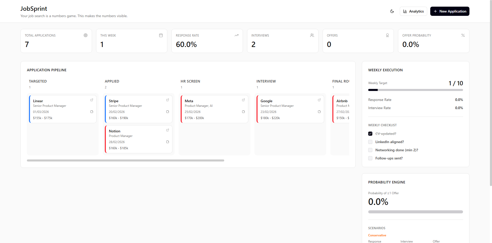
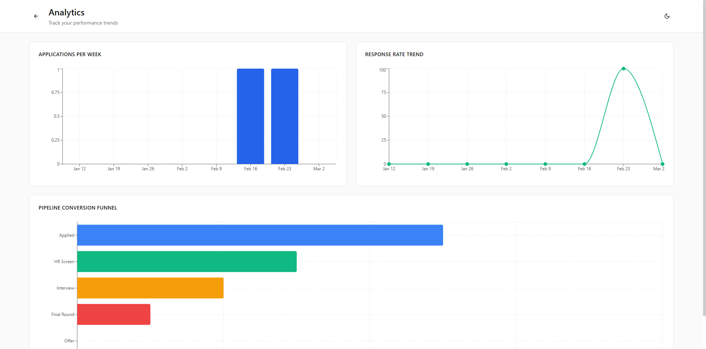

# JobSprint

JobSprint is a job-search execution dashboard for solo operators: track applications, monitor funnel conversion, and focus weekly effort on actions that improve your odds of getting an offer.

## 30-Second Pitch

Most job searches fail from inconsistent execution, not lack of talent. JobSprint gives you a visible pipeline, weekly execution targets, and analytics so you can run your search like a measurable production system.

## Current Status

- Stage: MVP (single-user, local-first)
- Scope: dashboard, pipeline tracking, analytics, weekly execution panel
- Adoption: AI Production OS v1 process added on March 2, 2026

## Tech Stack

- Vite + React + TypeScript
- React Router
- Tailwind CSS
- Recharts
- Radix UI primitives

## Setup

```bash
npm install
npm run dev
```

Build for production:

```bash
npm run build
```

## Deploy

- Current production URL: https://job-sprint-ten.vercel.app/
- Hosting: Vercel

## Screenshots

### Dashboard


### Analytics


## Documentation

- [PRD](./docs/PRD.md)
- [Architecture](./docs/ARCHITECTURE.md)
- [Roadmap](./docs/ROADMAP.md)
- [Decisions Log](./docs/DECISIONS_LOG.md)
- [Workflow Automation Playbook](./docs/WORKFLOW_AUTOMATION_PLAYBOOK.md)
- [Contributing Guide](./CONTRIBUTING.md)
- [Changelog](./CHANGELOG.md)
  
