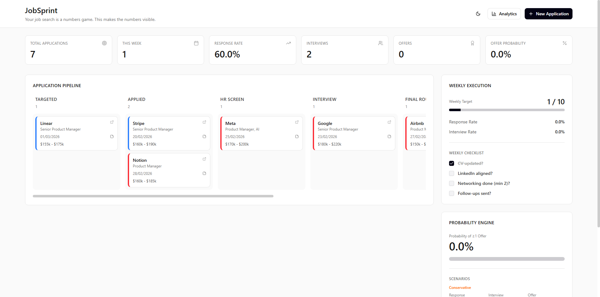
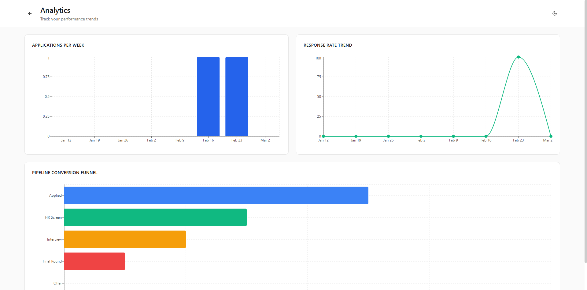

# Case Study: Assets Vault as a CV Operating System

Last updated: 2026-03-19

Hosted demo page: https://job-sprint-ten.vercel.app/case-study/assets-vault

## Demo Surface

### Command Centre Context

### Analytics Context

These screenshots show the operating-system framing around the feature: JobSprint is not just storing data, it is helping the candidate decide, act, and iterate. Assets Vault now plugs into that broader loop by keeping the execution inputs clean and reusable.

## Problem

Most job-search trackers treat CVs as static files. That breaks down quickly when one candidate is applying across multiple lanes:

- one generic CV becomes overloaded
- application rows drift away from the CV version they actually used
- renaming or replacing a CV makes historical records ambiguous
- reusable scripts and templates become copy-paste clutter instead of durable assets

## What JobSprint Changed

JobSprint now treats Assets Vault as a small operating system for execution assets rather than a file shelf.

### CV Constructor

- Users can manage up to 5 intentional CV variants.
- One CV is marked as the default suggestion across the app.
- CVs can be created, duplicated, renamed, linked to a tailoring profile, and deleted.
- Each CV shows readiness, usage, and optimizer activity signals.

### Stable CV Linking

- Application records now carry a stable `cvAssetId`.
- CV labels continue to render even for older records through backward-compatible fallback logic.
- Renaming a CV no longer breaks the application-to-CV relationship.

### Reusable Text Assets

- Scripts and templates can now be edited inline inside Assets Vault.
- Delete actions use proper confirmation instead of browser-native prompts.
- Toast feedback makes edits and deletes visible instead of silent.

## User Outcome

This improves the app in three ways:

1. The candidate can maintain a small, intentional CV library instead of one constantly-mutating document.
2. The optimizer and application tracker stay aligned on which CV was actually used.
3. Assets Vault becomes an active execution surface, not a passive storage page.

## Why This Matters

This feature makes JobSprint feel less like a tracker and more like an execution OS:

- dashboard tells the user what to do next
- Job OS keeps the pipeline coherent
- Assets Vault keeps the inputs clean and reusable

That combination is much closer to a credible portfolio story than a generic CRUD app.

## Suggested Demo Flow

1. Open Assets Vault and create a base CV.
2. Duplicate it into a role-specific variant.
3. Set the new CV as default.
4. Rename the original CV.
5. Open Applications and show that linked rows still resolve to the correct asset.
6. Open CV Optimizer and show the selected application pulling the right CV context.
